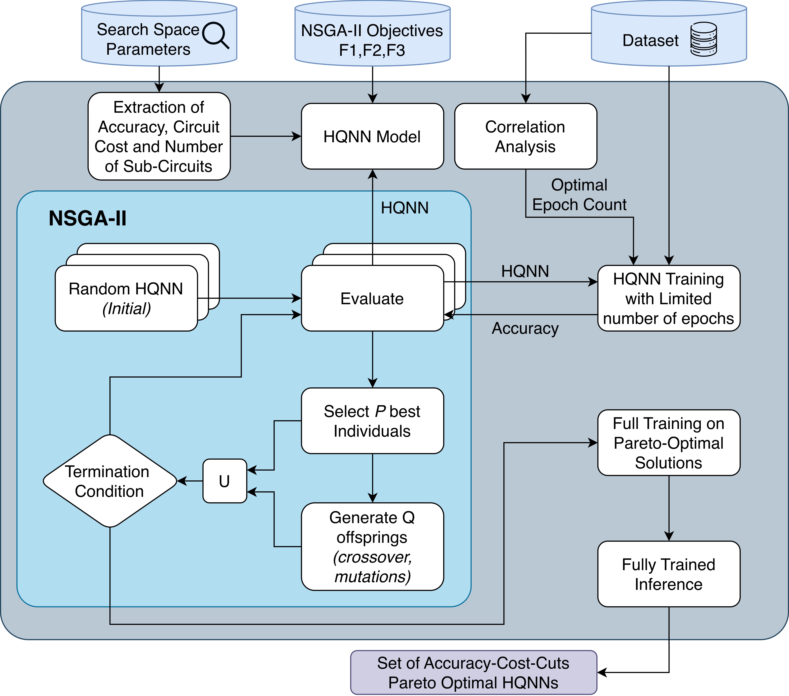
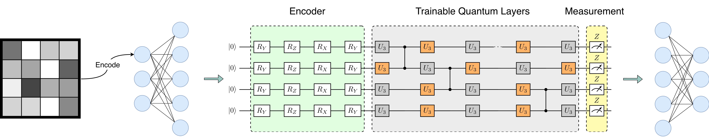
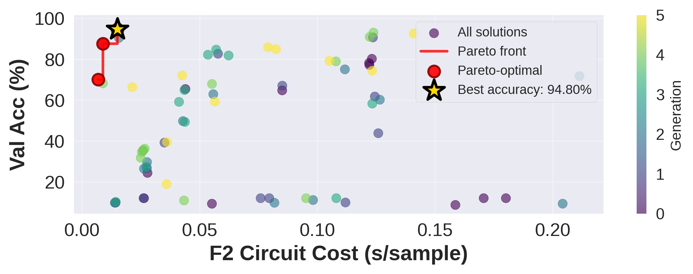

# QNAS — Quantum Neural Architecture Search

Multi-objective optimization framework for automated architecture search of Hybrid Quantum-Classical Neural Networks using the NSGA-II evolutionary algorithm.

## Abstract

This framework addresses the challenge of designing hybrid quantum-classical neural network architectures by formulating it as a multi-objective optimization problem. We employ NSGA-II to simultaneously optimize competing objectives: classification accuracy, quantum circuit cost, and circuit partitionability for near-term quantum hardware. The framework discovers Pareto-optimal architectures that balance model performance against quantum resource constraints, enabling practical deployment on NISQ devices.

The search space encompasses quantum circuit hyperparameters (qubit count, circuit depth, entanglement topology, embedding strategy) and training parameters (learning rate). A checkpoint-based correlation analysis provides early stopping capabilities by predicting final model performance from partial training, significantly reducing computational overhead during architecture search.

## Key Contributions

- **Multi-objective QNAS optimization**: Joint optimization of accuracy, circuit cost, and wire-cutting feasibility
- **Automated architecture search**: Discovers quantum circuit configurations without manual hyperparameter tuning
- **Early performance prediction**: Checkpoint correlation analysis enables early termination of unpromising candidates
- **Hardware-aware search**: Wire-cutting objective promotes architectures suitable for qubit-limited devices

## Framework Overview

<p align="center">
  
</p>
<p align="center"><em>End-to-end QNAS pipeline: search space, NSGA-II optimization, and Pareto-optimal architecture selection.</em></p>

The framework combines classical neural network layers with parameterized quantum circuits:

<p align="center">
  
</p>
<p align="center"><em>Hybrid quantum-classical neural network architecture.</em></p>

**NSGA-II Optimization Loop:**
1. Initialize population of random hybrid QNN configurations
2. Evaluate each candidate: train briefly, measure objectives
3. Apply non-dominated sorting and crowding distance selection
4. Generate offspring through crossover and mutation
5. Repeat until convergence

**Objectives:**
- `f1`: Classification error (1 - accuracy)
- `f2`: Circuit execution cost (gate count, depth)
- `f3`: Number of subcircuits after wire-cutting (optional)

**Example Pareto Front:**

<p align="center">
  
</p>
<p align="center"><em>Accuracy vs. circuit cost (f2) with Pareto front.</em></p>

## Installation

```bash
git clone https://github.com/Kooshano/QNAS
cd QNAS
pip install -r requirements.txt
```

Requires Python 3.8+ and CUDA-capable GPU.

## Quick Start

```bash
# 1. Configure
cp .env.example .env

# 2. Run NSGA-II optimization
python -m qnas.main

# 3. Visualize results (plots go to outputs/figures/)
python scripts/analysis/plot.py logs/nsga-ii/MNIST/run_<timestamp>
```

## Reproducibility

Each run directory (`logs/nsga-ii/{dataset}/run_{timestamp}/`) contains:
- `nsga_evals.csv` - All candidate evaluations with objectives
- `nsga_gen_summary.csv` - Per-generation statistics
- `train_epoch_log.csv` - Training curves
- `config_{timestamp}.env` - Configuration snapshot

To reproduce: copy the `config_{timestamp}.env` from a run directory to project root as `.env` and re-execute.

## Project Structure

```
QNAS/
├── qnas/                           # Core framework (QNAS package)
│   ├── main.py                     # Entry point
│   ├── models/
│   │   ├── config.py               # QConfig dataclass
│   │   └── hybrid_qnn.py           # HybridQNN model
│   ├── quantum/
│   │   ├── circuits.py             # Variational circuit construction
│   │   └── metrics.py              # Circuit cost functions
│   ├── training/
│   │   ├── trainer.py              # Training loop
│   │   └── checkpoint.py           # Checkpoint validation
│   ├── nsga2/
│   │   ├── problem.py              # QNNHyperProblem definition
│   │   ├── runner.py               # NSGA-II execution
│   │   └── callbacks.py            # Progress callbacks
│   └── utils/
│       ├── config.py               # Configuration loading
│       ├── datasets.py             # Dataset utilities
│       └── logging_utils.py        # CSV logging
├── scripts/
│   ├── analysis/
│   │   ├── plot.py                 # Visualization suite
│   │   ├── plot_common.py          # Shared plotting config/utilities
│   │   └── correlate_nsga_vs_final.py
│   └── training/
│       └── run_final_training.py   # Pareto front retraining
├── docs/figures/                   # README figures (pipeline, architecture, Pareto)
├── .env.example                    # Configuration template
├── requirements.txt
└── LICENSE
```

## Configuration

Key parameters in `.env`:

| Parameter | Description | Default |
|-----------|-------------|---------|
| `DATASET` | mnist, fashion-mnist, cifar10, svhn, iris, heart-failure | mnist |
| `POP_SIZE` | Population size | 12 |
| `N_GEN` | Generations | 6 |
| `EVAL_EPOCHS` | Epochs per candidate | 2 |
| `TRAIN_DROP_LAST` | Drop incomplete final training batch | false |
| `NQ_MIN/MAX` | Qubit range | 2-8 |
| `DEPTH_MIN/MAX` | Circuit depth range | 1-4 |
| `SHOTS` | 0=adjoint, >0=parameter-shift | 0 |
| `LOG_DIR` | Root directory for run logs | ./logs |

## Directory Structure

**Logs** (`logs/`): run data written by the framework (configured by `LOG_DIR` in `.env`):
- **Base:** `LOG_DIR` (default `./logs`) is the root for all run logs.
- **Per run:** Each NSGA-II run gets `logs/nsga-ii/{DATASET}/run_{timestamp}/` (this path is `DATASET_LOG_DIR`). All CSVs, `progress.log`, and a `config_{timestamp}.env` snapshot live here. Scripts that continue training or run final training point at this run directory.

```
logs/
└── nsga-ii/
    └── MNIST/
        └── run_20260101-120000/
            ├── nsga_evals.csv
            ├── nsga_gen_summary.csv
            ├── train_epoch_log.csv
            ├── progress.log
            ├── config_20260101-120000.env
            └── status/
```

**Outputs** (`outputs/`): generated artifacts (not in `.env`; created by scripts):
- **`outputs/figures/`**: plots from `scripts/analysis/plot.py` (Pareto, evolution, heatmaps, etc.).
- **`outputs/circuit_diagrams/`**: circuit visualizations from `scripts/utils/transpile_circuit.py`.

So: **logs** = where the framework records each run; **outputs** = where analysis/transpile scripts write figures and diagrams. Both are gitignored.

**Weights** (`weights/`): Saved model checkpoints (gitignored).

**Data** (`data/`): Downloaded datasets (gitignored).

## Dependencies

- PyTorch, torchvision
- PennyLane, pennylane-lightning
- pymoo
- NumPy, Pandas, Matplotlib, Seaborn

## Citation

```bibtex
@software{qnas,
  author = {Maleki, Kooshan},
  title = {QNAS: Quantum Neural Architecture Search},
  year = {2025},
  url = {https://github.com/Kooshano/QNAS},
  orcid = {https://orcid.org/0009-0007-9865-6049}
}
```

## License

MIT License. See [LICENSE](LICENSE).
